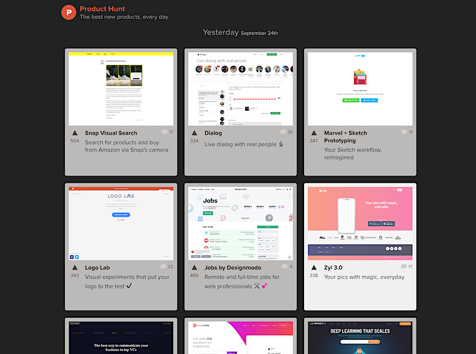

# How to make your Chrome & the Product Hunt new tab **very dark**
---

## Step 1 (optional):

Install the Chrome Mojave theme to make Chrome dark

https://chrome.google.com/webstore/detail/macos-mojave-dark-mode/emoadoophllahfgbjaidlhjgnnmmdigh?hl=en

## Step 2:

Go to terminal and `cd` into a folder you keep your stuff in. Then clone the repo: 

`git clone git@github.com:czekaj/producthunt-chrome-newtab-dark.git`

## Step 3:

Enable Developer mode for Chrome extensions & load the cloned extension folder

## Step 4:

Done!

